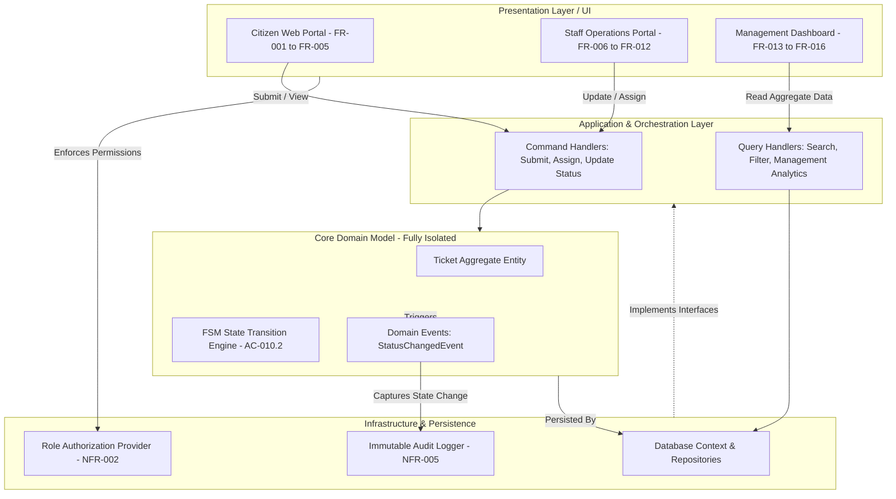
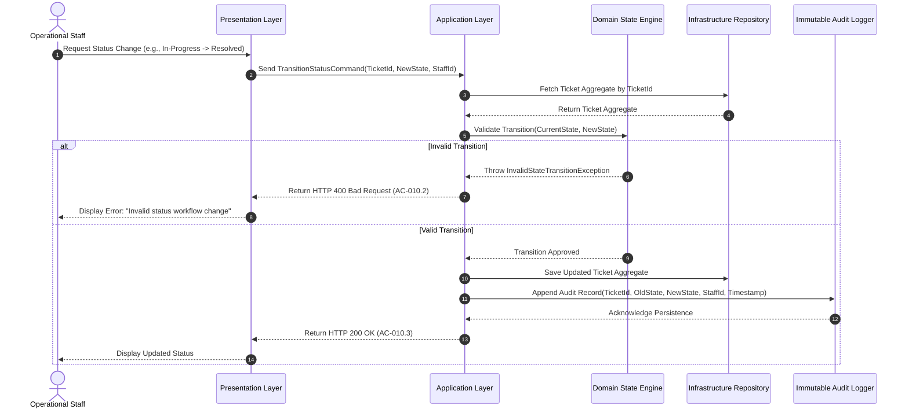

# CivicConnect — Architecture Baseline & System Design (Milestone 2)

## 1. Evaluation of Architectural Alternatives

| Architectural Style | Description | Strengths for CivicConnect | Weaknesses & Fatal Flaws | Verdict |
|---|---|---|---|---|
| **Style 1: Distributed Microservices** | Independent deployable services (Auth, Ticket, Reporting, Audit) communicating across HTTP/gRPC network boundaries. | Independent scaling; isolated service failures. | Severe network latency and serialization overhead jeopardizes the 3.0s latency SLA (NFR-001). Distributed transactions require two-phase commits or Saga patterns, which are completely disproportionate for a 3-person student team with zero budget. | **REJECTED** |
| **Style 2: Traditional Layered Monolith (3-Tier)** | Presentation, Business Logic, and Data Access Layers sharing a common runtime and database without enforced internal boundaries. | Simple initial setup; familiar paradigm. | Controllers routinely bypass domain logic to call database contexts directly, causing architectural erosion. Makes enforcing strict state-machine rules brittle and resists isolated automated unit testing (NFR-007). | **REJECTED** |
| **Style 3: Modular Monolith (Clean / Hexagonal)** | A single deployable process structured internally into distinct, decoupled bounded modules interacting via explicit in-memory interface contracts. | Eliminates network latency (in-memory execution ensures NFR-001 compliance); zero infrastructure cost; strictly isolates domain rules and POPIA data; enables automated unit testing without database dependencies (NFR-007). | Requires strict code review discipline to prevent developers from making direct cross-module database calls. | **SELECTED BASELINE** |

---

## 2. Logical Module Decomposition & Layer Boundaries

* **Presentation Layer (`CivicConnect.WebUI / API`):** Handles HTTP user interactions for Citizen Portal, Staff Console, and Management Dashboards. Translates user inputs into structured application commands without containing business rules.
* **Application Layer (`CivicConnect.Application`):** Coordinates application use cases via Command Handlers (write operations: submit, assign, update) and Query Handlers (read operations: search, filter, reporting).
* **Domain Layer (`CivicConnect.Domain`):** Fully isolated core domain model containing the Ticket Aggregate, business validation rules, and the Finite State Machine engine enforcing valid lifecycle transitions. Zero dependencies on databases or UI frameworks.
* **Infrastructure Layer (`CivicConnect.Infrastructure`):** Implements persistence repositories, database mappings, role-based access providers (NFR-002), and the immutable audit logger (NFR-005).

---

## 3. Architecture Diagrams

### Logical Architecture Diagram

### Sequence Trace Diagram
