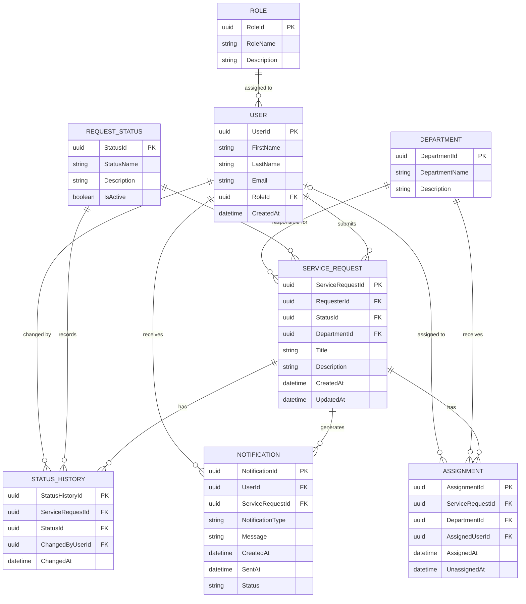

# CivicConnect Initial Entity Relationship Diagram

**Milestone:** Milestone 2  
**Document Type:** Initial ERD  
**Project:** CivicConnect  
**Status:** Proposed – Pending Team Review  
**Owner:** Member 2  
**Related Document:** `docs/data/data-model.md`

---

## 1. Purpose

This document defines the initial Entity Relationship Diagram (ERD) for
CivicConnect.

The ERD translates the initial M2 data model into a relational representation
showing:

- entities;
- primary keys;
- foreign keys;
- important attributes;
- relationships;
- cardinalities.

The ERD is an initial M2 engineering artefact and may evolve as the
persistence implementation and remaining project decisions are completed.

---

## 2. Initial CivicConnect ERD



---

# 3. Entity Descriptions

## 3.1 Role

`ROLE` represents a role assigned to a CivicConnect user.

Examples of the eventual role catalogue must come from the approved
CivicConnect authorisation model rather than being invented by the ERD.

### Primary Key

`RoleId`

### Relationship

One Role may be associated with multiple Users.

```text
ROLE 1 ─────────── * USER
```

This relationship supports the role-based access concerns associated with
NFR-002.

---

## 3.2 User

`USER` represents a person who interacts with CivicConnect.

A user may act as a requester or may perform authorised operational
activities depending on the role assigned to that user.

### Primary Key

`UserId`

### Foreign Key

`RoleId → ROLE.RoleId`

### Relationships

A User may:

- submit multiple service requests;
- perform multiple status changes;
- receive multiple notifications;
- participate in assignments where individual staff assignment is supported.

---

# 4. ServiceRequest

`SERVICE_REQUEST` is the central entity in the CivicConnect data model.

It represents a civic service request submitted by a requester.

### Primary Key

`ServiceRequestId`

### Foreign Keys

`RequesterId → USER.UserId`

`StatusId → REQUEST_STATUS.StatusId`

`DepartmentId → DEPARTMENT.DepartmentId`

### Important Relationships

One User may submit many ServiceRequests.

```text
USER 1 ─────────── * SERVICE_REQUEST
```

Each ServiceRequest has one current RequestStatus.

```text
REQUEST_STATUS 1 ─────────── * SERVICE_REQUEST
```

A Department may be responsible for multiple ServiceRequests.

```text
DEPARTMENT 1 ─────────── * SERVICE_REQUEST
```

The department relationship may be optional during stages where a newly
submitted request has not yet been routed or assigned.

---

# 5. RequestStatus

`REQUEST_STATUS` represents a recognised service-request lifecycle state.

### Primary Key

`StatusId`

### Relationships

A RequestStatus may be the current status of multiple ServiceRequests.

A RequestStatus may also occur in multiple StatusHistory records.

### Important Design Boundary

The ERD defines how statuses can be stored.

It does **not** define which status transitions are valid.

For example, this ERD must not be interpreted as allowing:

```text
Any Status → Any Status
```

The allowed lifecycle transition rules belong to the approved
Domain/Application lifecycle-governance design.

---

# 6. StatusHistory

`STATUS_HISTORY` records changes made to a ServiceRequest's status.

This entity is especially important for the project's auditability
requirements.

### Primary Key

`StatusHistoryId`

### Foreign Keys

`ServiceRequestId → SERVICE_REQUEST.ServiceRequestId`

`StatusId → REQUEST_STATUS.StatusId`

`ChangedByUserId → USER.UserId`

### Relationship

One ServiceRequest may have many status-history records.

```text
SERVICE_REQUEST
       1
       |
       |
       *
STATUS_HISTORY
```

Each history record identifies:

- the affected request;
- the new status;
- the user who made the change;
- when the change occurred.

This supports the current NFR-005 auditability requirement.

---

# 7. Department

`DEPARTMENT` represents an operational group responsible for handling
relevant CivicConnect service requests.

### Primary Key

`DepartmentId`

### Relationships

A Department may:

- be responsible for multiple ServiceRequests;
- receive multiple Assignments.

The actual department catalogue must come from approved project/domain
information.

---

# 8. Assignment

`ASSIGNMENT` records assignment of responsibility for a ServiceRequest.

### Primary Key

`AssignmentId`

### Foreign Keys

`ServiceRequestId → SERVICE_REQUEST.ServiceRequestId`

`DepartmentId → DEPARTMENT.DepartmentId`

`AssignedUserId → USER.UserId`

### Relationships

One ServiceRequest may have multiple Assignment records over its lifecycle.

```text
SERVICE_REQUEST 1 ─────────── * ASSIGNMENT
```

One Department may have multiple Assignment records.

```text
DEPARTMENT 1 ─────────── * ASSIGNMENT
```

A User may have multiple assignments where individual staff assignment is
supported.

### Assignment History

Using separate Assignment records allows CivicConnect to preserve assignment
history rather than simply overwriting the previous assignment.

For example:

```text
Request #101

Assignment 1
Department A
10:00
      ↓

Assignment 2
Department B
14:00
```

Whether this full history behaviour is required must still be confirmed
against the final operational requirements.

---

# 9. Notification

`NOTIFICATION` represents feedback associated with a CivicConnect
ServiceRequest and recipient.

This entity is proposed to support the FR-005 feedback requirement and the
notification design work being completed during M2.

### Primary Key

`NotificationId`

### Foreign Keys

`UserId → USER.UserId`

`ServiceRequestId → SERVICE_REQUEST.ServiceRequestId`

### Relationships

One ServiceRequest may generate multiple Notifications.

```text
SERVICE_REQUEST 1 ─────────── * NOTIFICATION
```

One User may receive multiple Notifications.

```text
USER 1 ─────────── * NOTIFICATION
```

### Important Design Boundary

The existence of a Notification record does not mean the Domain entity sends
an SMS, email or push notification directly.

The M2 notification architecture decision determines how lifecycle events are
translated into notification processing and how external providers are
isolated from the Domain layer.

---

# 10. Relationship Summary

| Parent | Child | Relationship |
|---|---|---|
| Role | User | One-to-Many |
| User | ServiceRequest | One-to-Many |
| RequestStatus | ServiceRequest | One-to-Many |
| Department | ServiceRequest | One-to-Many |
| ServiceRequest | StatusHistory | One-to-Many |
| RequestStatus | StatusHistory | One-to-Many |
| User | StatusHistory | One-to-Many |
| ServiceRequest | Assignment | One-to-Many |
| Department | Assignment | One-to-Many |
| User | Assignment | Optional One-to-Many |
| ServiceRequest | Notification | One-to-Many |
| User | Notification | One-to-Many |

---

# 11. Referential Integrity

The relational implementation should maintain referential integrity between
the entities.

Examples include:

1. A ServiceRequest cannot reference a User that does not exist.

2. A ServiceRequest cannot reference a RequestStatus that does not exist.

3. A StatusHistory record cannot reference a ServiceRequest that does not
   exist.

4. A StatusHistory record must identify the User responsible for the status
   change.

5. An Assignment must reference an existing ServiceRequest.

6. A Notification must reference an existing recipient and related
   ServiceRequest.

The exact deletion behaviour for related records must be decided during
persistence design rather than automatically applying cascading deletion.

---

# 12. Transactional Consistency

Some CivicConnect operations may affect multiple records.

A status update is an important example.

Conceptually:

ServiceRequest
     |
     | Change status
     v
UPDATE SERVICE_REQUEST
     |
     +----> INSERT STATUS_HISTORY
```

These operations may need to execute within the same transaction.

If one operation fails, the system should avoid leaving inconsistent data such
as:

```text
ServiceRequest.Status = Resolved

BUT

StatusHistory = no corresponding record
```

The final transaction strategy will be documented in the persistence
evaluation.

---

# 13. Concurrency

The system may encounter situations where multiple authorised users attempt
to modify the same ServiceRequest.

Example:

```text
Staff A reads Request #101
             |
Staff B reads Request #101
             |
Staff A updates status
             |
Staff B updates old version
```

This creates a possible concurrency problem.

The ERD identifies this concern but does not prescribe the final concurrency
mechanism.

The selected persistence/database approach must determine how concurrent
updates will be detected or controlled.

---

# 14. Indexing Considerations

Indexes should be based on actual application query patterns rather than being
added without evidence.

Potential candidates for later evaluation include:

- ServiceRequest.RequesterId
- ServiceRequest.StatusId
- ServiceRequest.DepartmentId
- ServiceRequest.CreatedAt
- StatusHistory.ServiceRequestId
- Assignment.ServiceRequestId
- Notification.UserId
- Notification.ServiceRequestId

The final indexing strategy should be determined after the team's expected
queries and workload are better understood.

---

# 15. Security Considerations

The database model supports role-related information, but security cannot be
implemented only through the ERD.

The application must enforce:

- authentication;
- authorisation;
- role restrictions;
- request-data access rules.

Credentials and API secrets must not be stored as ordinary values in these
tables or committed to source control.

---

# 16. Data Growth Considerations

The entities most likely to grow continuously are:

```text
SERVICE_REQUEST

STATUS_HISTORY

ASSIGNMENT

NOTIFICATION
```

For example, one ServiceRequest may accumulate multiple status-history and
notification records.

This should be considered later when defining:

- indexes;
- query patterns;
- retention;
- archiving;
- reporting;
- database capacity.

No unsupported capacity numbers are assumed at this stage.

---

# 17. Architecture Alignment

The ERD represents persistence requirements but does not change the
architecture selected during M2.

The intended relationship remains:

```text
CivicConnect.Domain
        |
        | entities / business behaviour
        v

CivicConnect.Application
        |
        | use cases / abstractions
        v

CivicConnect.Infrastructure
        |
        | ORM / repository implementation
        v

Relational Database
```

The Domain layer should not depend directly on the selected database.

---

# 18. Proposed EF Core Mapping

If Entity Framework Core is formally selected, the database mapping should
remain inside Infrastructure.

For example:

```text
CivicConnect.Infrastructure/
|
+-- Persistence/
    |
    +-- CivicConnectDbContext.cs
    |
    +-- Configurations/
    |   |
    |   +-- UserConfiguration.cs
    |   +-- RoleConfiguration.cs
    |   +-- ServiceRequestConfiguration.cs
    |   +-- RequestStatusConfiguration.cs
    |   +-- StatusHistoryConfiguration.cs
    |   +-- DepartmentConfiguration.cs
    |   +-- AssignmentConfiguration.cs
    |   +-- NotificationConfiguration.cs
    |
    +-- Migrations/
```

This mapping is proposed and should only become implementation evidence after
the persistence technology has been approved and the code exists.

---

# 19. Requirements Traceability

The ERD contributes to the following current requirement areas:

| Entity | Requirement / Concern |
|---|---|
| User | User identity and ownership |
| Role | NFR-002 role-based access |
| ServiceRequest | Core request-management functionality |
| RequestStatus | FR-010 / FR-012 |
| StatusHistory | NFR-005 |
| Notification | FR-005 / AC-005.1 |
| Assignment | Operational request handling |
| Department | Operational routing/responsibility |

The full M2 RTM will provide the final trace from requirements to architecture,
data, design, implementation and verification.

---

# 20. Open ERD Decisions

The following details still require confirmation:

- [ ] Final RequestStatus catalogue.
- [ ] Allowed lifecycle transition map.
- [ ] Final Role catalogue.
- [ ] Whether ServiceRequest.DepartmentId should remain directly on the
      request when Assignment already represents responsibility.
- [ ] Whether individual staff assignment is required.
- [ ] Whether all notifications must be persisted.
- [ ] Whether previous status should also be stored directly in
      StatusHistory.
- [ ] Final database product.
- [ ] Concurrency-control mechanism.
- [ ] Delete behaviour for related records.
- [ ] Final indexing strategy.
- [ ] Data-retention requirements.

These items must be resolved through later M2 engineering decisions rather
than silently assumed.

---

# 21. ERD Status

**Status: PROPOSED**

The ERD can move to **ACCEPTED** when:

- [ ] entities are reviewed against the requirements;
- [ ] relationships are reviewed;
- [ ] cardinalities are confirmed;
- [ ] remaining data questions are resolved where required for M2;
- [ ] the persistence approach is selected;
- [ ] the database technology is selected;
- [ ] the ERD is referenced by the PED;
- [ ] relevant RTM entries are updated.

---

# 22. Next Step

The next Member 2 activity is:

**Step 5 — Persistence and Database Evaluation**

The workflow is:

Data Model
    |
    v
Initial ERD
    |
    v
Persistence Evaluation
    |
    v
Database Selection
    |
    v
Decision / ADR
    |
    v
Implementation
